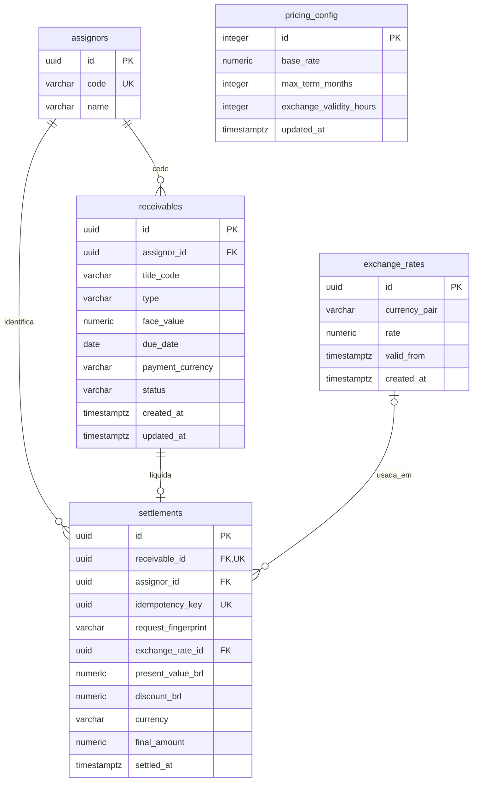

# Modelo relacional

Fonte: `src/main/resources/db/migration/V1__initial_schema.sql`. Diagrama resumido; a migration é a definição completa de colunas e constraints.

- Cedente possui zero ou mais títulos; cada título possui no máximo uma liquidação (`UNIQUE receivable_id`). `UNIQUE(assignor_id, title_code)` impede duplicar a identificação comercial.
- Cotações são únicas por `(currency_pair, valid_from)`. Liquidação BRL não referencia câmbio; USD exige referência, valor positivo e vigência no snapshot.
- `pricing_config` é singleton (`id = 1`), sem FK de liquidação: parâmetros efetivos são copiados para o snapshot, não lidos retrospectivamente.
- `settlements` também guarda nome/código do cedente/título, tipo, face, vencimento, referência, prazo, base, spread, taxa efetiva e câmbio usado/vigência. A duplicação deliberada preserva o histórico mesmo que os cadastros mudem.
- Dinheiro NUMERIC(19,2); taxas NUMERIC(19,10); câmbio NUMERIC(24,10). CHECKs validam sinais, domínio, soma de taxas, deságio e coerência BRL/USD. Timestamps são TIMESTAMPTZ, serializados em UTC.
- Índices: recebíveis por criação/ID, liquidações por instante/ID e por cedente/instante. Filtro por moeda não tem índice dedicado; medir antes de acrescentar.

Não há tabela de simulação, lote ou importação. Estados do recebível são PENDING/SETTLED; estados de reconfirmação/erro/incerteza pertencem ao fluxo da interface. A aplicação não oferece alteração de liquidações; a demonstração não implementa proteção contra UPDATE SQL executado por administrador.
